## OpenTranshub

随着大语言模型的普及，计算机网络课程训练的重点正从代码编写转向解决真实网络环境下的复杂问题。计算机网络赛训平台OpenTranshub，旨在通过阶梯式编程训练、多样化网络场景以及实时评测反馈，引导学生在竞赛式打榜与持续迭代中解决拥塞控制、丢包、时延等真实问题，实现从理解到应用再到创新的系统能力进阶。

OpenTranshub 基于 UDP 协议进行实现，提供传输协议基本的功能模块，如序号、包类型、确认机制等，并提供如发送、接收等预制的接口 API。使用者需要在该框架上，修改 controller.cc 代码中的内容，实现一个拥塞控制算法，尽可能地提高网络性能。平台通过模拟不同的网络环境，并针对丢包、时延和吞吐量三个维度进行综合评分，对参赛者提供的拥塞控制算法进行评估。

项目由前端界面和后端服务两部分组成，本仓库作为主仓库，通过 Git Submodule 统一关联并管理前后端代码仓库。

### 演示版系统

- 访问地址：[https://transhub.litonglab.com/](https://transhub.litonglab.com/)

### 系统截图

#### 学生端

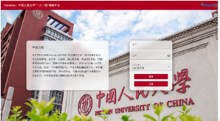

图 1：注册登录

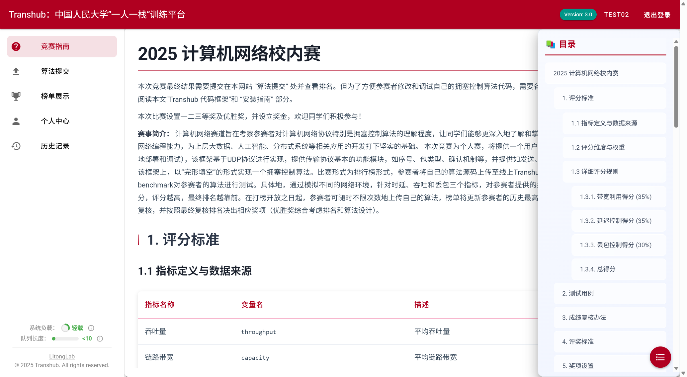

图 2：阅读平台使用指南

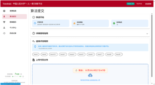

图 3：设计算法并提交测试

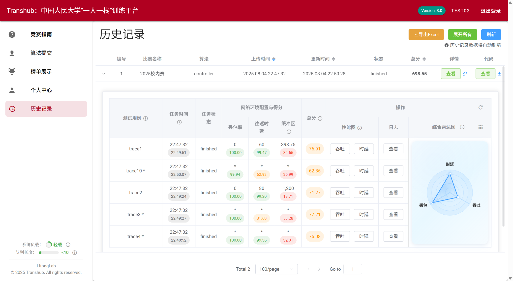

图 4：查看算法运行效果和各维度评分

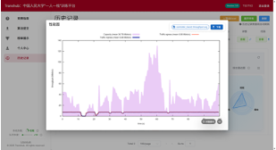

图 5：查看整个运行过程的吞吐量图

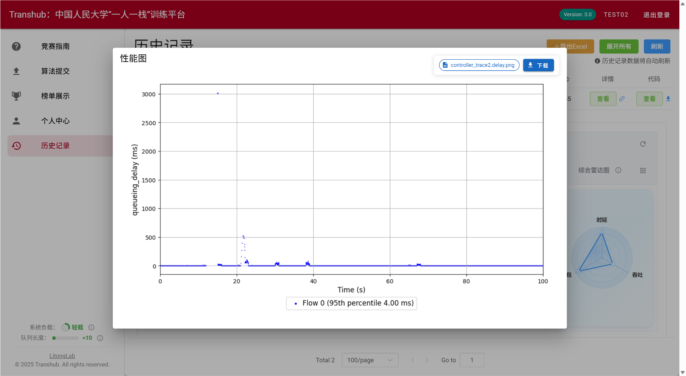

图 6：查看整个运行过程的时延图

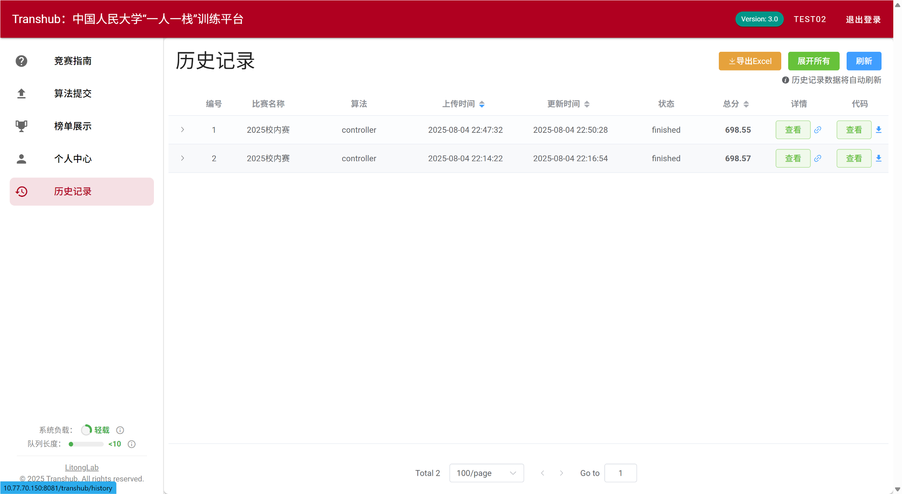

图 7：根据历史记录多次迭代自己的算法

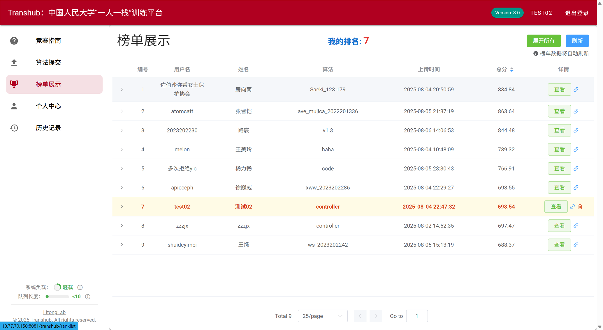

图 8：参与榜单排名

#### 教师端

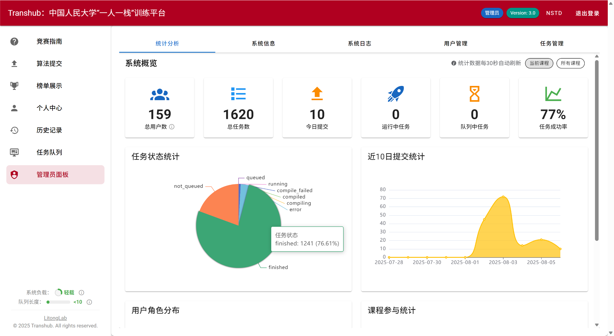

图 9：教师端统计分析

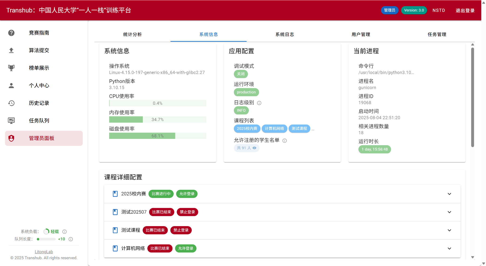

图 10：教师端系统信息

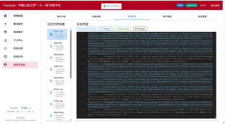

图 11：教师端系统日志

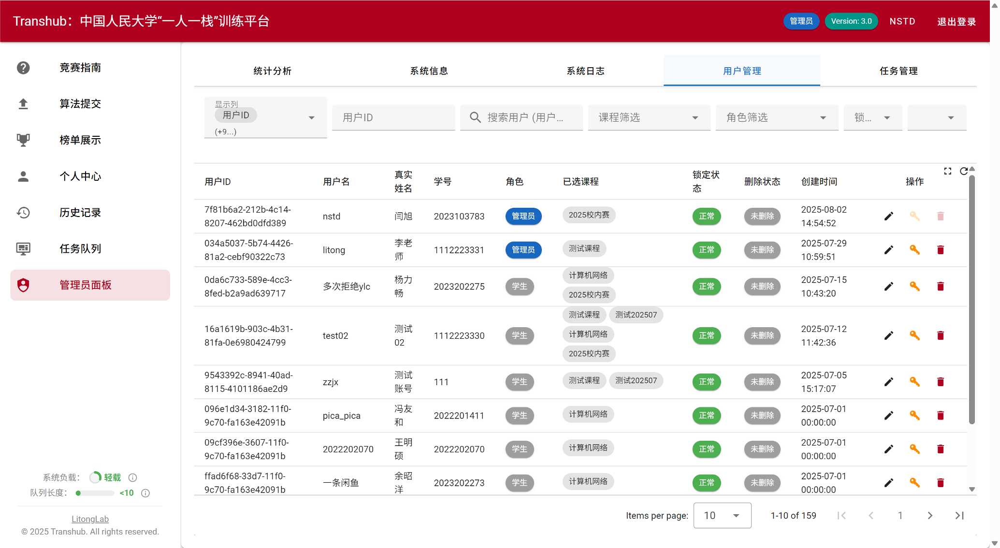

图 12：教师端用户管理

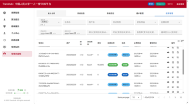

图 13：教师端任务管理

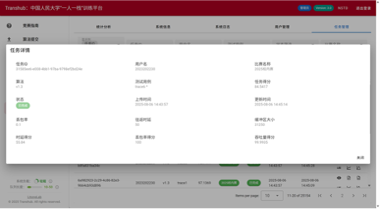

图 14：教师端任务分析

### 项目组成

| 模块     | 目录         | 仓库地址                                                         | 说明                                                                                                     |
| -------- | ------------ | ---------------------------------------------------------------- | -------------------------------------------------------------------------------------------------------- |
| 前端     | `frontend` | [transhub_frontend](https://github.com/litonglab/transhub_frontend) | 基于 Vue 3、Vite、Vuetify 和 Element Plus 构建，提供用户登录、任务上传、历史记录、排行榜、管理后台等页面 |
| 后端     | `backend`  | [transhub_backend](https://github.com/litonglab/transhub_backend)   | 基于 Flask 构建，使用 MySQL、Redis 和 Dramatiq 支持数据管理、用户认证、任务队列、评测与后台处理          |
| 教学资源 | `docs`     | [Transhub-Appendix](https://github.com/litonglab/Transhub-Appendix) | 提供课件、教学资料和竞赛相关资源                                                                         |

### 仓库结构

```text
transhub/
├── .gitmodules        # Git Submodule 配置
├── frontend/          # 前端子仓库
├── backend/           # 后端子仓库
└── docs/              # 课件、教学资料和竞赛资源
```

### 克隆项目

推荐使用 `--recurse-submodules` 一次性克隆主仓库及其子模块：

```bash
git clone --recurse-submodules <main-repository-url>
cd transhub
```

如果已经克隆了主仓库，但尚未初始化子模块，可以执行：

```bash
git submodule update --init --recursive
```

### 前端开发

进入前端目录并安装依赖：

```bash
cd frontend
npm install
```

启动开发服务器：

```bash
npm run dev
```

构建生产版本：

```bash
npm run build
```

前端开发环境的后端接口地址主要通过 `frontend/.env.development` 配置；生产环境配置位于 `frontend/.env.production`。

### 后端开发

进入后端目录并安装依赖：

```bash
cd backend
pip install -r requirements.txt
```

创建并编辑开发环境配置：

```bash
cp .env.example .env.development
```

同时需要根据后端说明，将 `app_backend/config/config_example.py` 复制为对应环境配置文件，并按需修改数据库、Redis、基础目录等配置。

启动 Flask 应用：

```bash
python run.py
```

默认情况下，后端服务监听：

```text
http://127.0.0.1:54321
```

后端的异步评测与绘图任务依赖 Dramatiq 和 Redis，可按需启动对应任务队列进程。生产环境推荐使用后端仓库中的 `supervisor_manager.sh` 管理服务。

### 子模块常用操作

查看当前子模块状态：

```bash
git submodule status
```

拉取子模块远程最新提交：

```bash
git submodule update --remote --merge
```

当子模块更新后，需要在主仓库中提交新的子模块指针：

```bash
git add .gitmodules frontend backend README.md
git commit -m "Add Transhub project README and submodules"
```

### 更多说明

- 前端详细说明请查看 `frontend/README.md`
- 后端详细说明请查看 `backend/Readme.md`
- 课件、教学资料和竞赛资源请查看 `docs` 目录
- 后端部署、配置、任务队列和日志说明以 `backend` 子仓库文档为准
